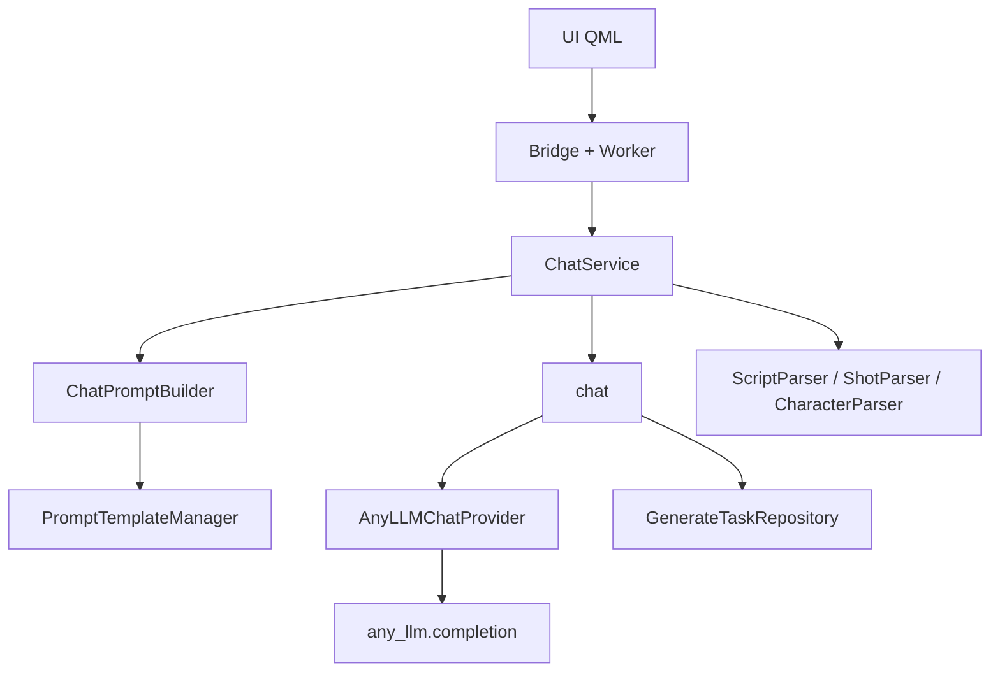

# 文本模型调用链路

本文档描述 AI 视频生成工具中，各业务功能调用文本大模型的完整链路（基于当前代码现状）。

---

## 架构概览

所有文本模型调用统一走以下四层链路：

```
UI (QML)
  ↓ 调用 Bridge 方法
Bridge Layer (Python QObject) + Worker (QThread)
  ↓ 调用 ChatService 业务方法
ChatService (service/chat_service.py)
  ↓ 使用 ChatPromptBuilder 构建 messages
ChatPromptBuilder (prompts/chat_prompt_builder.py)
  ↓ 加载 YAML 模板
PromptTemplateManager → PromptTemplate.build_messages()
  ↓ 返回 messages 列表
ChatService.chat()
  ↓ 创建 generate_tasks 记录 + 重试调用
AnyLLMChatProvider (providers/anyllm_chat.py)
  ↓ any_llm.completion()
OpenAI 兼容 API（默认 DashScope compatible-mode）
  ↓ 返回文本
ChatService
  ↓ 解析结构化数据（如有）+ 更新任务状态
Service 保存到数据库 → Bridge 信号通知 QML
```



---

## 核心组件

### ChatService — `service/chat_service.py`

统一的文本模型调用入口，职责包括：

- 通过 `ChatPromptBuilder` 构建各业务的 messages
- 通过 `chat()` 统一发起模型调用
- 写入 `generate_tasks` 任务记录
- 超时重试（1800 秒，最多 2 次）
- 调用 Parser 解析 JSON 结构化输出

Provider 管理：

```python
_PROVIDER_REGISTRY = {"dashscope": AnyLLMChatProvider}
```

- 读取 `settings.default_chat_provider`（默认 `dashscope`）
- 通过 `ConfigManager.resolve_config_for_type(..., "chat")` 获取 API Key 和模型配置

### ChatPromptBuilder — `prompts/chat_prompt_builder.py`

所有文本 Prompt 的唯一构建入口，每个业务方法对应一个 YAML 模板。

### AnyLLMChatProvider — `providers/anyllm_chat.py`

基于 `any-llm-sdk` 的 Provider 实现：

- 默认 API：`https://dashscope.aliyuncs.com/compatible-mode/v1`
- 调用方式：`any_llm.completion(model, messages, api_key, api_base, ...)`
- DashScope 模型名自动映射为 `openai/qwen-max` 等形式
- 支持 `max_tokens` 等参数透传

### 依赖注入 — `di/containers.py`

```python
text_prompt_builder = Singleton(ChatPromptBuilder, template_manager=...)
chat_model_service  = Singleton(ChatService, config_manager=..., session_manager=..., text_prompt_builder=...)
```

`AppBridge` 将 `chat_model_service` 注入各业务 Bridge。

---

## 业务调用链路

### 1. 优化大纲

| 层级 | 文件 | 方法 |
|------|------|------|
| Bridge | `bridge/story_outline_bridge.py` | `optimize()` |
| Worker | `bridge/workers.py` | `OutlineOptimizeWorker.run()` |
| Service | `service/chat_service.py` | `optimize_story_outline()` |
| Prompt | `prompts/chat_prompt_builder.py` | `build_outline_optimization_messages()` |
| 模板 | `prompts/templates/outline_optimize.yaml` | — |

```
StoryOutlineBridge.optimize
  → OutlineOptimizeWorker
  → ChatService.optimize_story_outline
  → ChatPromptBuilder.build_outline_optimization_messages
  → ChatService.chat
  → AnyLLMChatProvider.chat
```

任务类型：`GenerateTaskType.CHAT`，`GenerateTaskCallerType.OUTLINE`

---

### 2. 生成剧本

| 层级 | 文件 | 方法 |
|------|------|------|
| Bridge | `bridge/screenplay_bridge.py` | `generate_script()` |
| Worker | `bridge/workers.py` | `ScriptGenerateWorker.run()` |
| Service | `service/chat_service.py` | `generate_script()` |
| Prompt | `prompts/chat_prompt_builder.py` | `build_script_generation_messages()` |
| 模板 | `prompts/templates/script_generate.yaml` | — |
| 解析 | `utils/script_parser.py` | `ScriptParser.parse()` |

特殊参数：`max_tokens=16384`

任务类型：`GenerateTaskCallerType.SCRIPT`

---

### 3. 优化剧本

| 层级 | 文件 | 方法 |
|------|------|------|
| Bridge | `bridge/screenplay_bridge.py` | `optimize_screenplay()` |
| Worker | `bridge/workers.py` | `ScreenplayOptimizeWorker.run()` |
| Service | `service/chat_service.py` | `optimize_screenplay()` |
| Prompt | `prompts/chat_prompt_builder.py` | `build_screenplay_optimization_messages()` |
| 模板 | `prompts/templates/screenplay_optimize.yaml` | — |
| 解析 | `utils/script_parser.py` | `ScriptParser.parse()` |

---

### 4. 生成角色

| 层级 | 文件 | 方法 |
|------|------|------|
| Bridge | `bridge/character_bridge.py` | `generate_characters()` |
| Worker | `bridge/workers.py` | `CharacterWorker.run()` (mode=generate) |
| Service | `service/chat_service.py` | `generate_characters()` |
| Prompt | `prompts/chat_prompt_builder.py` | `build_character_generation_messages()` |
| 模板 | `prompts/templates/character_generate.yaml` | — |
| 解析 | `utils/character_parser.py` | `CharacterParser.parse()` |

任务类型：`GenerateTaskCallerType.CHARACTER`

---

### 5. 优化角色

| 层级 | 文件 | 方法 |
|------|------|------|
| Bridge | `bridge/character_bridge.py` | `optimize_characters()` |
| Worker | `bridge/workers.py` | `CharacterWorker.run()` (mode=optimize) |
| Service | `service/chat_service.py` | `optimize_characters()` |
| Prompt | `prompts/chat_prompt_builder.py` | `build_character_optimization_messages()` |
| 模板 | `prompts/templates/character_optimize.yaml` | — |
| 解析 | `utils/character_parser.py` | `CharacterParser.parse()` |

---

### 6. 修改角色描述

| 层级 | 文件 | 方法 |
|------|------|------|
| Bridge | `bridge/character_bridge.py` | `refine_character_description()` |
| Worker | `bridge/workers.py` | `CharacterRefineWorker.run()` |
| Service | `service/chat_service.py` | `refine_character_description()` |
| Prompt | `prompts/chat_prompt_builder.py` | `build_character_description_refine_messages()` |
| 模板 | `prompts/templates/character_refine.yaml` | — |

---

### 7. 生成分镜

| 层级 | 文件 | 方法 |
|------|------|------|
| Bridge | `bridge/storyboard_bridge.py` | `generate_storyboard()` |
| Worker | `bridge/workers.py` | `StoryboardGenerateWorker.run()` |
| Service | `service/chat_service.py` | `generate_storyboard()` |
| Prompt | `prompts/chat_prompt_builder.py` | `build_storyboard_generation_messages()` |
| 模板 | `prompts/templates/storyboard_generate.yaml` | — |
| 解析 | `utils/shot_parser.py` | `ShotParser.parse()` |

特殊参数：`max_tokens=16384`

任务类型：`GenerateTaskCallerType.STORYBOARD`

---

### 8. 优化分镜

| 层级 | 文件 | 方法 |
|------|------|------|
| Bridge | `bridge/storyboard_bridge.py` | `optimize_storyboard()` |
| Worker | `bridge/workers.py` | `StoryboardOptimizeWorker.run()` |
| Service | `service/chat_service.py` | `optimize_storyboard()` |
| Prompt | `prompts/chat_prompt_builder.py` | `build_storyboard_optimization_messages()` |
| 模板 | `prompts/templates/storyboard_optimize.yaml` | — |
| 解析 | `utils/shot_parser.py` | `ShotParser.parse()` |

---

### 9. 生成分镜设计图（两阶段）

#### 阶段 1：文本模型生成图片提示词

| 层级 | 文件 | 方法 |
|------|------|------|
| Bridge | `bridge/storyboard_bridge.py` | `generate_shot_design_image()` |
| Worker | `bridge/workers.py` | `DesignImageWorker.run()` |
| Service | `service/chat_service.py` | `generate_design_image_prompt()` |
| Prompt | `prompts/chat_prompt_builder.py` | `build_design_image_prompt_messages()` |
| 模板 | `prompts/templates/image_prompt.yaml` | — |

#### 阶段 2：图片模型生成设计图

```
ImageService.generate(prompt=..., local_path=..., parent_ids=str(chat_task_id))
  → DashScopeImageProvider（wan2.6-t2i）
  → TaskPollingService 轮询下载
```

任务关联：图片任务的 `parent_ids` 指向文本任务 ID。

---

### 10. 生成角色设计图（两阶段）

#### 阶段 1：文本模型生成图片提示词

| 层级 | 文件 | 方法 |
|------|------|------|
| Bridge | `bridge/character_bridge.py` | `generate_character_design_image()` |
| Worker | `bridge/workers.py` | `CharacterDesignImageWorker.run()` |
| Service | `service/chat_service.py` | `generate_character_design_image_prompt()` |
| Prompt | `prompts/chat_prompt_builder.py` | `build_character_design_image_prompt_messages()` |
| 模板 | `prompts/templates/character_image_prompt.yaml` | — |

#### 阶段 2：图片模型生成设计图

同分镜设计图，调用 `ImageService.generate()`，尺寸 `1280*1280`。

---

### 11. 生成项目封面图（两阶段）

#### 阶段 1：文本模型生成封面提示词

| 层级 | 文件 | 方法 |
|------|------|------|
| Bridge | `bridge/project_bridge.py` | `generate_cover()` |
| Worker | `bridge/workers.py` | `CoverGenerationWorker.run()` |
| Service | `service/chat_service.py` | `generate_cover_image_prompt()` |
| Prompt | `prompts/chat_prompt_builder.py` | `build_cover_image_prompt_messages()` |
| 模板 | `prompts/templates/cover_image_prompt.yaml` | — |

#### 阶段 2：图片模型生成封面

调用 `ImageService.generate()`。

任务类型：`GenerateTaskCallerType.COVER`

---

### 12. 批量视频生成 — 提示词清理

视频生成本身不调用文本模型，但在批量提交前会清理提示词中的对话和声音描述。

| 层级 | 文件 | 方法 |
|------|------|------|
| Bridge | `bridge/storyboard_bridge.py` | 批量视频生成流程 |
| Prompt 组装 | `prompts/video_prompt_builder.py` | `build_shot_prompt(clean_dialogue_and_sound=True)` |
| 清理入口 | `prompts/video_prompt_builder.py` | `clean_prompt()` |
| Service | `service/chat_service.py` | `clean_video_prompt()` |
| Prompt | `prompts/chat_prompt_builder.py` | `build_video_prompt_clean_messages()` |
| 模板 | `prompts/templates/video_prompt_clean.yaml` | — |

```
StoryboardBridge（批量视频）
  → VideoPromptBuilder.build_shot_prompt
  → VideoPromptBuilder.clean_prompt
  → ChatService.clean_video_prompt
  → ChatPromptBuilder.build_video_prompt_clean_messages
  → ChatService.chat
  → AnyLLMChatProvider.chat
```

清理失败时降级返回原始 prompt，不中断视频提交流程。

---

## ChatService 方法 ↔ PromptBuilder ↔ 模板 对照表

| ChatService 方法 | ChatPromptBuilder 方法 | YAML 模板 | 输出解析 |
|-----------------|----------------------|-----------|---------|
| `optimize_story_outline` | `build_outline_optimization_messages` | `outline_optimize` | 纯文本 |
| `generate_script` | `build_script_generation_messages` | `script_generate` | ScriptParser |
| `optimize_screenplay` | `build_screenplay_optimization_messages` | `screenplay_optimize` | ScriptParser |
| `generate_characters` | `build_character_generation_messages` | `character_generate` | CharacterParser |
| `optimize_characters` | `build_character_optimization_messages` | `character_optimize` | CharacterParser |
| `refine_character_description` | `build_character_description_refine_messages` | `character_refine` | 纯文本 |
| `generate_storyboard` | `build_storyboard_generation_messages` | `storyboard_generate` | ShotParser |
| `optimize_storyboard` | `build_storyboard_optimization_messages` | `storyboard_optimize` | ShotParser |
| `generate_design_image_prompt` | `build_design_image_prompt_messages` | `image_prompt` | 纯文本（英文提示词） |
| `generate_character_design_image_prompt` | `build_character_design_image_prompt_messages` | `character_image_prompt` | 纯文本（英文提示词） |
| `generate_cover_image_prompt` | `build_cover_image_prompt_messages` | `cover_image_prompt` | 纯文本（英文提示词） |
| `clean_video_prompt` | `build_video_prompt_clean_messages` | `video_prompt_clean` | 纯文本 |
| `chat`（底层） | —（由上层传入 messages） | — | — |

预留未使用：`build_chat_messages` → `chat.yaml`

---

## Worker 与 Bridge 对应关系

| Worker | Bridge | ChatService 方法 |
|--------|--------|-----------------|
| `OutlineOptimizeWorker` | `StoryOutlineBridge` | `optimize_story_outline` |
| `ScriptGenerateWorker` | `ScreenplayBridge` | `generate_script` |
| `ScreenplayOptimizeWorker` | `ScreenplayBridge` | `optimize_screenplay` |
| `CharacterWorker` | `CharacterBridge` | `generate_characters` / `optimize_characters` |
| `CharacterRefineWorker` | `CharacterBridge` | `refine_character_description` |
| `StoryboardGenerateWorker` | `StoryboardBridge` | `generate_storyboard` |
| `StoryboardOptimizeWorker` | `StoryboardBridge` | `optimize_storyboard` |
| `DesignImageWorker` | `StoryboardBridge` | `generate_design_image_prompt` |
| `BatchDesignImageWorker` | `StoryboardBridge` | `generate_design_image_prompt` |
| `CharacterDesignImageWorker` | `CharacterBridge` | `generate_character_design_image_prompt` |
| `CoverGenerationWorker` | `ProjectBridge` | `generate_cover_image_prompt` |
| `OptimizeWorker` | （通用，当前无调用方） | `chat` |

---

## 任务追踪

每次 `ChatService.chat()` 调用自动写入 `generate_tasks` 表：

| 字段 | 说明 |
|------|------|
| `provider_name` | 来自 `default_chat_provider` 配置 |
| `model_name` | 实际使用的模型名 |
| `type` | `CHAT` |
| `caller_type` | `OUTLINE` / `SCRIPT` / `CHARACTER` / `STORYBOARD` / `COVER` |
| `caller_id` | 项目 ID 或业务实体 ID |
| `parent_ids` | 父任务 ID（图片任务关联文本任务时使用） |
| `request_params` | JSON，含 messages、model、module、context 等 |
| `status` | `pending` → `succeeded` / `failed` |

---

## 设置页模型列表

| 层级 | 文件 | 方法 |
|------|------|------|
| Bridge | `bridge/settings_bridge.py` | `list_chat_models()` |
| Provider | `providers/anyllm_chat.py` | `list_available_models()` |

设置页与业务调用共用 `AnyLLMChatProvider`，通过 `/models` 接口拉取可用模型列表。

---

## 不涉及文本模型的相关流程

以下流程使用其他 Provider，不在本文档范围内：

| 功能 | Service | Provider |
|------|---------|----------|
| 分镜设计图 / 角色设计图 / 封面图生成 | `ImageService` | `DashScopeImageProvider`（wan2.6-t2i） |
| 分镜视频生成 | `VideoService` | `DashScopeVideoProvider`（wan2.7-t2v） |
| 视频 Prompt 结构化组装 | `VideoPromptBuilder.build_shot_prompt` | 本地字符串拼接，仅清理步骤调用文本模型 |

---

**文档更新时间：** 2026-08-14  
**适用版本：** AI Video GUI v1.0+
